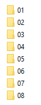

# Train sound box

This is an application for Arduino that creates a sound box for my N scale diorama.

## Starting 🚀

_Download the repository to your Arduino folder and import it inside the Arduino IDE._

### Pre-requirements 📋

1 Arduino UNO (Or another, it does not matter which one you use if it can supply 5v).

1 DFPlayer mini

8 resistors.
    - 1K ohms x 2
    - 2K ohms x 1
    - 3K ohms x 1
    - 5,1K ohms x 1
    - 6,5K ohms x 1
    - 10K ohms x 1
    - 100K ohms x 1
6 buttons
1 Mini SD card

### Loading sounds 🔧

SD card must be formatted in FAT32.

Main folder should contain the different options of the base menu. I have not been able to use descriptor names yet (I think it can be done but no lucky). So I used numbers. You have to use zero left padding in case of numbers from 1 to 9 as shown in the next image:

Inside of each folder you should fill it up with the different sounds. Here you need to use 2 zero left padding for number and, after a space, you can use a descriptor name:

Each song must be in MP3 format.

### Diagram 🔧

Connect everything as shown in the following image:

I have uploaded the Fritzing file too just in case.

## Requirements ✒️

* **DFRobot** - *DFPlayer Mini Library*  - [Github](https://github.com/DFRobot/DFRobotDFPlayerMini)
* **Arduino** - *Liquid Crystal Library* - [Reference](https://www.arduino.cc/en/Reference/LiquidCrystal)